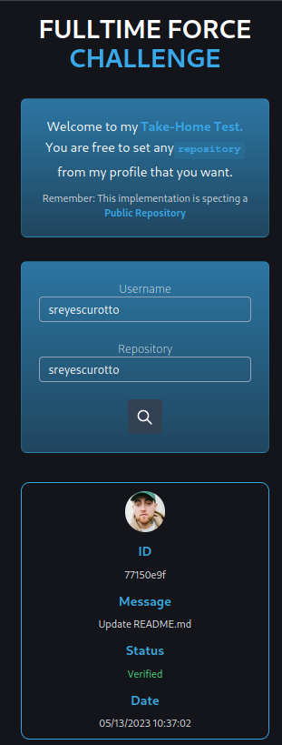

# FullTime Force

## Introduction



## Installation
Clone the repository:

   ```bash
   git clone https://github.com/sreyescurotto/fulltime-force-tt.git
   cd fulltime-force-tt
```
### Backend

This project is built using Nest.js. Requires Node.js version 18 or higher for installation.
``` bash
cd backend
```
###### Used pnpm as the package manager.

1. In a normal situation you should create an `.env` file, but I left the env file so you can skip this step

  ```
  GITHUB_KEY=
```

2. Install dependencies:
```bash 
pnpm i
```
3. Run the backend:
```bash
pnpm run start:dev
```
### Frontend

This project is build using Vite with React and tailwind.
Requires Node.js version 18 or higher for installation.

``` bash
cd frontend
```
###### Used pnpm as the package manager.

1. Install dependencies:
```bash 
pnpm i
```
2. Run the frontend:
```bash
pnpm run start:dev
```

